```mermaid
classDiagram

    direction TB  %% Força um layout de cima para baixo
      
    class Sincronizavel {
        +sincronizarDadosComDispositivo(Dispositivo dispositivo)
    }
    <<interface>> Sincronizavel

    class ReprodutorMusical {
        +selecionarMusica(String musica)
        +tocarMusica()
        +pausarMusica()
        +avaliarAlbum(String artista, String album, int estrelas)
        +navegarPelaListaDeArtistas()
    }

    class AparelhoTelefonico {
        +ligar(int numero)
        +iniciarCorreioVoz()
        +favoritarContato(String contato)
        +verificarChamadasPerdidas()
        +ouvirCorreioDeVoz(String contato)
    }

    class NavegadorInternet {
        +exibirPagina(String url)
        +adicionarNovaAba()
        +verificarAbasAbertas()
        +fecharAbaAberta()
        +atualizarPagina()
        +verificarPaginasNoBookmark()
    }

    class iPhone {
    }

    iPhone --> ReprodutorMusical
    iPhone --> AparelhoTelefonico
    iPhone --> NavegadorInternet


    AparelhoTelefonico --> Sincronizavel  %% Conexão forçando posição abaixo


```

# dio-trilha-java-UML

---

# 📱 Diagramação de Classes - iPhone 2007  

## Sobre o Projeto  
Este projeto tem como objetivo tentar representar, por meio de um **diagrama UML**, as principais funcionalidades do **primeiro iPhone**, lançado em **2007**. A modelagem das classes e interfaces foi baseada na icônica apresentação de Steve Jobs, onde ele destacou que o dispositivo combinava três produtos revolucionários em um só:  

- 📞 **Um telefone celular**  
- 🎵 **Um reprodutor de músicas**  
- 🌐 **Um navegador de internet**  

## 🛠 Ferramenta Utilizada  
A diagramação foi desenvolvida utilizando a linguagem **Mermaid**, uma ferramenta prática para criar diagramas diretamente em arquivos Markdown.  

## 🖥 Estrutura do Diagrama  
O diagrama foi modelado com as seguintes classes e interface:  

- **`iPhone`** → Classe principal que agrupa os três componentes principais.  
- **`AparelhoTelefonico`** → Responsável pelas funcionalidades de chamadas e correio de voz.  
- **`ReprodutorMusical`** → Representa as funções relacionadas à reprodução e controle de músicas.  
- **`NavegadorInternet`** → Modela as funções de navegação na web.  
- **`Sincronizavel`** → Uma interface que representa a capacidade de sincronização de dados com outros dispositivos.  

## 🎥 Referência  
A estrutura do diagrama foi baseada no vídeo oficial de lançamento do iPhone em 2007:  
🔗 [Apresentação do iPhone - 2007](https://youtu.be/9ou608QQRq8?si=C9TeNE3cdPxbYdWv)  

---

