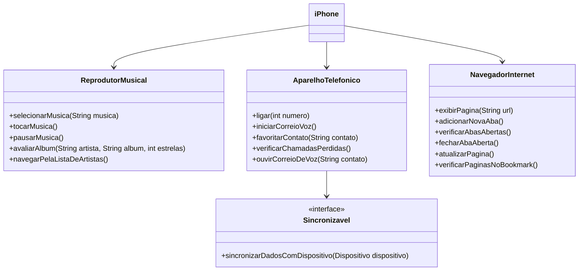

# dio-trilha-java-UML

```mermaid
classDiagram

    direction TB  %% Força um layout de cima para baixo
      
    class Sincronizavel {
        +sincronizarDadosComDispositivo(Dispositivo dispositivo)
    }
    <<interface>> Sincronizavel

    class ReprodutorMusical {
        +selecionarMusica(String musica)
        +tocarMusica()
        +pausarMusica()
        +avaliarAlbum(String artista, String album, int estrelas)
        +navegarPelaListaDeArtistas()
    }

    class AparelhoTelefonico {
        +ligar(int numero)
        +iniciarCorreioVoz()
        +favoritarContato(String contato)
        +verificarChamadasPerdidas()
        +ouvirCorreioDeVoz(String contato)
    }

    class NavegadorInternet {
        +exibirPagina(String url)
        +adicionarNovaAba()
        +verificarAbasAbertas()
        +fecharAbaAberta()
        +atualizarPagina()
        +verificarPaginasNoBookmark()
    }

    class iPhone {
    }

    iPhone --> ReprodutorMusical
    iPhone --> AparelhoTelefonico
    iPhone --> NavegadorInternet


    AparelhoTelefonico --> Sincronizavel  %% Conexão forçando posição abaixo


```
